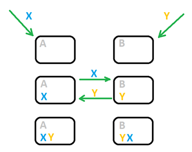

# 🤝 Consensus

Peer-to-peer decentralized systems consist of standard interchangeable nodes. In areas like swarm intelligence, nodes can store different information and, as a result, exhibit pretty complex behavior.&#x20;

In the world of accounting and finance, however, the task of such systems is to store and process transactions, which entails the need for complete duplication of data between nodes for fault tolerance.&#x20;

In other words, in blockchain, all nodes must store the same data about your account balance. And the concept of consensus helps a lot with this.

## Canonical history

We will start from afar - namely with the difference between accounting and ordinary mathematical actions.

The main difference is that operations in mathematics result in a single moment. There is a list of actions, and then you get an immediate answer:

> **5 + 2 + 3 - 9 = 1**

In accounting, operations may occur once a day or even once a year, so between them passes some appreciable time. And it would not be a hindrance if not another condition - the accounts may not have negative balances. What does it mean to record that there are -5 pairs of shoes left in the warehouse? Or, in the case of blockchain, what would a balance of -5 ETH mean?

Thus every transaction needs to be verified so that it does not result in a negative account balance. And while in record-keeping, there are many ways to deal with such incorrect transactions, blockchain can only reject them.

In math, we can rearrange the summands as we like, and the result won't change. When you mix transactions in accounting, it's easy to get an intermediate negative outcome. And, accordingly, some operations drop out of the calculation, and you get a completely different final result:&#x20;

> **5 + 2 - 9 (rejected) + 3 = 10**

So, because of the impossibility of having a negative account balance, the order of operations is crucial in the blockchain. Note that if the parameter counted by the decentralized system can take negative values, then the order of transactions does not matter.

"_What's the problem here?_" - The advanced computer user will exclaim - "_After all, every modern device has a built-in clock - you can just put a timestamp when the transaction appears!_"

And he would be wrong. The time on computers synchronized via the NTP service is slightly different. There are interruptions and delays on the network. At the same time, anyone can connect to the public blockchain - including attackers who can set the clock on their computers as they want.

What to do if the node receives a 5-minute old transaction while it has processed 100 000 transactions since then? It could be fraud or a network problem.

A correct operation which for some reason came with a long delay, can't be distinguished from a transaction with a fake time. And it could be the case only for this particular node - all other nodes could have received it on time and accounted for it. So, as a result, we cannot rely on real-world time.

But if we can't rely on real-world time, is it possible to create an internal time? No, that won't work either. And here's why.

The blockchain network is peer-to-peer, meaning all nodes are the same and must be completely interchangeable. Users can send their transactions to any of the nodes.

This is how two operations performed almost simultaneously (with a time difference less than the communication speed) end up in the mirror order of two different nodes.

But because of the limit on the propagation speed of information, the relativity principle from physics comes into play. Network nodes have different orders of transactions, yet each can be considered correct.

Let's extend our mental experiment and assume that 5 out of 20 servers received one operation each in a second. There are 20 ways in which we can mix those five operations.

And let's assume every server formed its unique sequence of operations (this is quite realistic). Since all the nodes are equal, there is no such thing as the correct order. For every node, its order of operations will be the only correct one.

The most impatient reader will exclaim: "_Oh, this is complicated! Let's write down the operations somehow._" And he will be right! To solve the problem of the single source of truth, we will need to abandon external causality.

In other words, we can account for operations in a completely different sequence than in the real world. More fundamental is that nodes agree on some order of operations. Such an agreement on the order of operations is called consensus.

## Leader

The easiest and most obvious way to achieve this is to choose one leader from the nodes so they can accept the leader's sequence of operations.

It is necessary to choose a leader in a way that all other nodes are sure about it. To achieve that, the leader must provide evidence of his leadership that he could not fake.

But doesn't appointing someone as a leader create a threat as a malignant actor can also become a leader? First, let's look at how a leader can NOT misbehave.

He can't forge a user's transaction since he would need the wallet's private key. A leader can only operate with user-made transactions. With this in mind, we are now ready to learn exactly how he can use his unique status to harm the network.

### **Threat 1: Silence**

A leader can remain silent and not set the order of transactions for everyone else. But since he will receive a reward for his work, it is not profitable.&#x20;

It may also happen if the leader's computer breaks down or is under a DoS attack. And if there isn't some mechanism for appointing a new leader, all other nodes will be waiting for the leader's actions, and the blockchain will hold still.

The solution to this problem is the self-appointment of the leader. That means that a node somehow mines on its own the evidence that the other nodes will accept, does the job, and sends unexpectedly to others the results of the work along with the proof.

For example, in the Proof of Work consensus (Bitcoin consensus), all nodes solve a mathematical problem, and everyone has a chance to find the answer. Whoever solves it first appoints himself as a leader.

In Proof of Stake algorithms (the new Ethereum consensus), the leader becomes known before he completes his task and can be DoS attacked. Then the next leader, and so on. As a result, leaders will fail one by one doing a job until the attack stops.

### **Threat 2: Several correct blocks**

A leader can take all the accumulated operations, for which he has to set the order, divide them, for example, in half (or in 3,4,5 parts) and send these different sets of operations to opposite ends of the network.

Then half of the nodes will assume that there was one set of operations in that period, and the other half will think that there was another set.

Thus, the same information will no longer be the same on all nodes, and the network will split into different subnets. The PoW consensus solves this problem by the rule that each new leader must choose the longest chain of blocks. But for the PoS consensus, this problem still does not have a guaranteed solution.

### **Threat 3: Censorship**

A leader may not include some transactions in the block, meaning they can be censored depending on a particular wallet or smart contract address. The easiest way to deal with this threat is to keep changing leaders.

So if the current leader censors certain transactions, the next one will handle them. This solution was also found (rather intuitively) in politics, where in democracies, the leader must constantly change.

### **Threat 4: Front-running**

A leader can create new operations on his behalf. For example, if he sees that someone buys a large volume of a token, he can put his transaction before the large purchase. It is called front-running. And at this point, it's up to each network to decide how to deal with this problem. And whether to fight it at all.

### **Threat 5: Sybil attacks**

While anyone can become a network node, and there is no cost to obtain proof of leadership, a malicious actor can create many nodes under his control, increasing his probability of becoming a leader in each round.

And have a disproportionate amount of rewards. We are talking about Sybil attacks, the protection against which in the Elysium network we will describe closer to the launch of the network.

## Some dummy consensuses

In general, it is possible to think of many variants of consensus, knowing that the main problem is maintaining the same order of operations by many nodes. Each consensus type will have its characteristics, advantages, and disadvantages. Further, we provide a couple of examples to show that there are plenty of consensus options that can be thought of, and we don't have to rely on PoW or PoS alone.

### **Example 1**

We can pack each transaction that comes from a client into a separate block and then build these blocks based on the valuation of some virtual value of the blockchain.

We can assume that the chain with the higher number of different validators is the most valuable. In this case, each validator, having received a transaction from a customer, packs it into a block and sends it to all other validators.

They, in turn, create their own blocks based on this transaction and send them out. As a result, all validators will choose the block whose creator made his previous block as long ago as possible. And the most intriguing fact is that this approach works - we've simulated it.

But this consensus type has one global disadvantage - it creates enormous network traffic.

Each client's operation causes a lot of network messages, whose amount is equal to the square of the validators' count. After all, each has to forward their version of the block with the operation to everyone else.

### **Example 2**

Here is another idea for consensus. We can make the clients' wallets regularly send their votes to the validators.

For example, such a vote could be a hash of the timestamp and address of the client. Those validators can take the vote whose addresses and the vote's hash calculates to some predetermined value. The first one who collects 1000 votes has the right to make a new block.

With this approach, there is another problem - each block must contain 1000 votes as proof that the validator had the right to make it.

This leads to an immense increase in block size and, consequently, a rapid growth of the blockchain archive size.
