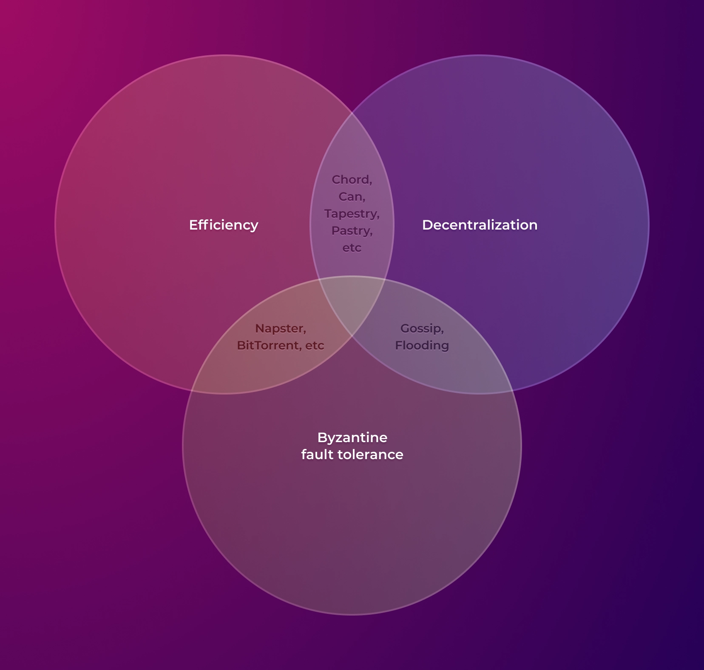

# 📫 哈希环

## 为什么创建一条合适的路由很难？

在许多领域中，寻找两点之间的路径是一个相关的问题：从邮政快递的包裹投递到选择地铁换乘站。

在计算机技术中，可能需要路由来搜索多台计算机上的所需文件，或者将消息发送给连接到通信网络节点之一的特定客户端。

没有能力建立路由，互联网将无法正常工作。但全球网络是建立在分层原则之上的，在本节中，我们将试图理解平坦的点对点网络中的路由。

#### 地图路由

乍一看，这个任务看起来并不复杂。毕竟，在地图上查看最短路径有什么困难呢？

<figure><figcaption></figcaption></figure>

问题在于，通过查看连接图，我们立即从“外部”估计整个网络的拓扑结构，就好像是从外部看一样。与此同时，在点对点系统中，每个节点必须以某种方式从系统的“内部”看到连接图。

为了实现这一目标，最先想到的是将地图存储在系统外部，例如在特定服务器上。最早的点对点系统的开发人员就是这样做的。但是，即使是针对单个功能的集中式方法，在实践中也被证明会使系统变得容易受到攻击。


例如，我们可以回忆一下Napster的故事，当时存储文件路由的搜索服务器被政府关闭，用户失去了搜索功能的访问权限，而其他功能也因此变得毫无意义。


如果将地图放在单独的服务器上是一个不好的主意，我们是否可以实现一种协议来交换有关连接的信息，以帮助节点形成对最优路线的自我感知呢？

这种方法的主要缺点是更改特定连接并及时通知网络中的其他节点之间存在时间滞后。例如，在图表中，如果客户端B重新连接到节点5，网络中的其他节点将不会立即知道，并且在一段时间内继续将所有消息发送到节点6。

<figure><figcaption></figcaption></figure>

随着网络节点数量的增加，这个问题只会变得更糟，因为节点越多，它们连接和断开的频率就越高，而信息传递到所有节点的速度会降低。因此，在某一点上，大多数消息将通过使用过时的拓扑信息建立的错误路由进行发送。

此外，随着地图的复杂性增加，寻找每个中间点的下一条路线也将变得指数级（指数级）。换句话说，迷宫越复杂，计算任务找到出口的方式就越困难。此外，由于迷宫还在不断变化，必须在每个点上解决找到最佳路线的计算问题。

> 在通过描述相对较宽的历史拓扑的地图发送消息到特定目标时，要么需要集中式地图（其中信息更新速度比平均消息沿路线行进的速度更快），要么消息可能永远无法到达目标。

#### 覆盖路由

在Napster被封锁之后，几乎立即出现了一些协议，允许分散方式下的存储和搜索信息：[Chord](https://en.wikipedia.org/wiki/Chord_\(peer-to-peer\))(2001)、[CAN](https://en.wikipedia.org/wiki/Content-addressable_network)(2001)、[Pastry](https://en.wikipedia.org/wiki/Pastry_\(DHT\))(2001)、[Tapestry](https://en.wikipedia.org/wiki/Tapestry_\(DHT\))(2004)等等。

这些协议的逻辑类似——创建一个虚拟地址空间（覆盖层），在其中分布所有对象（例如文件）以便节点之间进行服务。

这种方法与几乎每个国家的邮政服务使用的邮政编码没有什么不同，其中一个邮局的邮政编码对应于其附近的几个房屋。

在使用这些协议时，由于拓扑结构不是作为给定的而是通过特定规则动态形成的，可以在不构建整个连接地图的情况下有效地将消息从发送者发送到接收者。


换句话说，地图不是节点之间连接的结果，而是导致它们之间连接的原因。


例如，Chord协议涉及将地址空间创建为一个圆，圆的每个部分由一个节点提供服务。在这种情况下，每个文件（当我们谈论存储数据系统时）对应于圆上的一个特定点，该点属于特定服务器的责任区域。

<figure><figcaption></figcaption></figure>

服务器必须按照特定规则相互连接，这使得它们即使没有整个连接地图，也可以知道在哪里转发请求，以便接近存储所需文件的服务器。

<figure><figcaption></figcaption></figure>

但对于这样一个正确且高效的系统，需要具有适当结构的拓扑。在这方面出现了问题，

在没有单一拓扑真理的情况下，无法消除确认其可用性但不转发客户请求的恶意节点。

> 结构化的拓扑允许在分散和高效的方式下进行可寻址的消息转发。但是，这样的拓扑无法免受恶意行为的影响。

#### 盲目路由

因此，无论我们如何使用路由地图，我们都无法在平坦的点对点网络中建立一个具有容错能力和分散式的系统。那么在没有地图的情况下是否可以实现呢？

在没有地图的情况下，每个节点只知道它可以直接通信的邻居节点。显然，在这种情况下，无法确定应将特定消息发送到哪个邻居节点以接近目的地。

<figure><figcaption></figcaption></figure>

这就是[Gossip](https://en.wikipedia.org/wiki/Gossip_protocol)和[Flooding](https://en.wikipedia.org/wiki/Flooding_(computer_networking))协议的逻辑，它们专门针对这种架构创建，明确要求节点接收到的消息发送到所有邻居节点。

这两种协议在细节上略有不同。Flooding立即执行并对网络造成重负载，而Gossip则会随时间分散网络负载，导致消息转发明显变慢。

<figure><figcaption></figcaption></figure>

这两种协议可以在同一网络中结合使用。例如，最关键的消息可以通过Flooding发送，而不太重要的消息可以通过Gossip发送。结果是，Flooding/Gossip的不同实现在所有无结构网络中工作，其中节点之间的连接是随机形成的（最常见的情况是手动连接节点）。

这种没有内部结构的网络不允许恶意行为者攻击拓扑，因为如果没有拓扑规则，他们就无法违反节点的相互连接规则。

此外，即使恶意节点不执行其转发工作，消息仍将通过其他路径传递到所有节点。如果这样的恶意节点不接受连接，新加入的节点可以通过任何其他节点加入网络。

不出所料，比特币采用了这种方法。但与其他领域一样，可靠性的代价是效率的降低。由于工作节点的数量是未知的，因此不清楚将一个块传递给大多数节点需要多长时间，因此比特币的设计假设块之间存在过长的十分钟延迟。

> 将消息发送到所有邻居节点并不意味着可以进行可寻址的消息传递，这使得两个节点之间的有效通信成为不可能。毕竟，任何消息最终都会通过所有可能的路径传递。并且随着节点数量的增加，网络负载将呈指数级增长。

## DEB定理

在为平坦的点对点网络实现通信协议时，根据拓扑形成方法，最多只能提供以下三个属性中的两个：

* 分散化 - 所有系统功能由网络节点自己执行；
* 效率 - 在传递到特定收件人的消息中，尽可能快地交付，网络负载增长速度比网络中节点数量慢；
* 拜占庭错误容忍 - 一个或多个节点的恶意行为无法对系统造成不可逆的损害。

<figure><figcaption></figcaption></figure>

## Elysium哈希环

根据我们刚刚提出的DEB定理，无法在分散式点对点网络中构建高效的通信。正是因为这个原因，真正分散式系统的发展目前正处于深度危机之中。

但是，DEB定理只适用于平坦的点对点网络，并不适用于层次化的公共集群架构，该架构首次提供了同时实现分散化、效率和对恶意节点行为的抵抗能力的可能性。

在Elysium公共集群中，分散化由无主方法保证，地址层上的效率是由结构化拓扑实现的，而对抗恶意节点行为的鲁棒性则是通过断言层具有BFT属性实现的，从而可以作为其他层的唯一真理源，并赋予它们BFT属性。

断言层对恶意节点行为的抵抗性是通过在Keepers之间没有任何结构和连接规则的情况下进行通信，使用Flooding/Gossip协议进行通信实现的。这使得可以在断言层上形成一个与比特币网络相同原理的点对点网络。

<figure><figcaption></figcaption></figure>

此外，断言层的层次结构顶部有效地平衡了故障容错性和该层次上的信息分发速度，因为它免受各种攻击类型的侵害，并且Keeper的数量是有限的。

地址层的形成是基于哈希环拓扑，假设将所有可能的钱包地址空间卷入一个环中。路由器根据其地址放置在这个环上，并负责顺时针到下一个路由器的部门。换句话说，整

个地址环被划分给路由器，每个参与者都与一个特定的路由器相连，使得每个人都能准确确定消息应该沿着环发送给哪个参与者。

同时，每个路由器必须与其他几个更远的路由器相连，这样距离路由器越远，它的邻居就越少。

<figure><figcaption></figcaption></figure>

关于地址环的逻辑和连接规则的更多详细信息可以在Chord协议的描述中找到，因为在这些方面，哈希环与Chord协议完全兼容。

<figure><figcaption></figcaption></figure>

拓扑构建过程是Hash Ring协议与Chord协议之间的主要区别。虽然Chord协议根据节点之间的局部交互规则生成网络，但Elysium公共集群的地址层基于存储在区块链中的数据进行构建。


有[合理的疑虑](http://www.pamelazave.com/chord-ccr.pdf)认为Chord协议中节点的本地交互无法保证在任何情况下（甚至不考虑参与者的恶意行为）形成完美的地址环。


通过在区块链中存储关于当前工作路由器的信息，不仅可以比使用Chord协议更可靠地形成地址环，更重要的是，它通过强制执行多个规则，为具有结构化拓扑的网络赋予了BFT属性。

#### 地址层的消息转发

从BFT的角度来看，地址层消息的寻址是一个最大的问题之一，因为最有效的转发消息的方法是通过单一路径。因此，如果恶意节点不沿着路由继续传递消息，源节点和目标节点将不会知道这一点。这使得攻击者可以对特定钱包的某些交易进行审查。

当然，可以实现消息传递的确认系统。但是，确认消息仍然只会通过一条路线（即使不同）。如果丢失，发送方将陷入无法确保传递成功的初始情况。因此，丢弃传递确认允许恶意节点对系统产生与审查消息本身相同的威胁。

在任何需要提高可靠性的工程系统中，增加关键通信通道的冗余是一种更简单、更重要的增加故障容错性的方法。因此，在Elysium地址层中，每个消息必须由发送者所连接的初始路由器发送给其所有邻居。

<figure><figcaption></figcaption></figure>

当然，通过多条路径转发会增加网络负载，但它的增长速度将比路由器数量慢。最终，它仍然比使用Flooding/Gossip协议在所有可能的路线上传递消息要高效得多。

这种方法不仅增加了消息传递的可靠性，还允许路径的最终节点确定单个路径的故障，从而使得能够自动清理故障和恶意路由器的拓扑成为可能。

#### 连接和断开路由器与地址层

正如前面提到的，当具有无结构拓扑的网络增长时，节点之间的链接映射（路由表）会以指数级增加，因此即使对于最强大的计算机来说，在每个路由点上确定进一步转发的节点也可能成为一个计算上的挑

战。

为了解决这个问题，Elysium公共集群使用了更加复杂的拓扑结构，其中路由器被组织成树状结构，该结构基于路由器之间的区块链存储的数据。

在这种结构中，每个节点都可以确定它的上游节点和下游节点，并通过更短的路由路径将消息传递给它们。

<figure><figcaption></figcaption></figure>

当一个新的路由器加入网络时，它将连接到现有路由器，成为其子节点之一。这种连接过程是通过在区块链中进行事务完成的，并且所有参与者都可以看到新路由器的连接事务。

同样，当一个路由器离开网络时，它将断开与其父节点的连接，并通过区块链中的事务通知整个网络。这样，网络中的其他节点就可以更新其路由表，以便沿着其他路径进行消息传递。

这种连接和断开路由器的机制使得整个网络能够自动适应拓扑的变化，并保持高效的通信能力。

总结来说，Elysium公共集群中的地址层使用哈希环拓扑来构建分散化和高效的通信网络。哈希环的形成和维护是通过区块链中存储的数据和连接/断开路由器的机制实现的。这种结构允许节点之间的可靠消息传递，并具有鲁棒性来对抗恶意节点的行为。