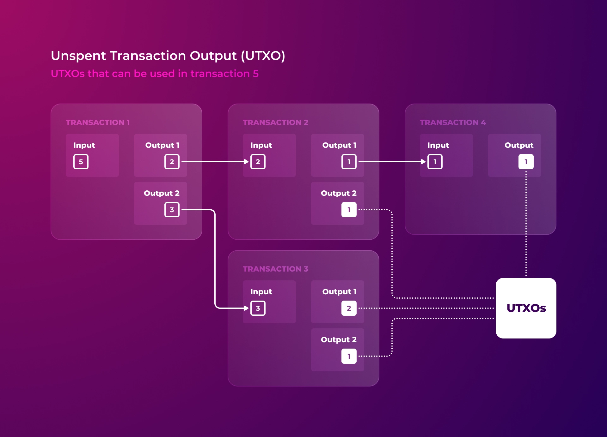

# ⛓ Statechain

## **What makes popular blockchains so huge?**

The size of information stored in blockchains such as Bitcoin and Ethereum currently exceeds 430GB and 580GB, respectively, and continues to grow at an accelerating rate.

<figure><figcaption></figcaption></figure>

The problem is that blockchain cannot be split, even if we set aside security issues. After all, getting a complete and consistent view of accounting is impossible based on just part of the blocks not containing all transactions.

Because of this, every new participant connecting as a node to Bitcoin or Ethereum network must download and process all blocks and stored transactions, starting with the Genesis block. At the moment, it takes a few days, and the situation will worsen over the years.

Therefore, the more information accumulates in the blockchain over time, the higher the entry barrier for new node owners becomes, potentially creating a serious threat to the decentralization of a network.


Information in popular blockchains is accumulating at a rate that outpaces technological progress, which means that it will not fit the largest hard drive available on the market in the foreseeable future. So sooner or later, only large data centers with multiple servers will be able to serve as nodes.


That is why it is crucial to build blockchain accounting in a way that will not, over time, exponentially increase the amount of information stored. And the choice is between only two basic models of accounting.

#### Bitcoin: UTXO Model

The Proof of Work consensus in Bitcoin creates a protected blockchain that contains a log of all transactions. And because the blockchain must record all transactions, the number of which depends only on user activity, the amount of data stored by the network's nodes not only increases over time but has no limit to its growth.

<figure><figcaption></figcaption></figure>

Bitcoin accounting is built on the principle of UTXO (Unspent Transaction Output), which implies using the result of one transaction, not yet spent, as an input to another.

<figure><figcaption></figcaption></figure>

In other words, the system tracks not how many coins are in the user's account but whether or not the person who signed the transaction has the right to spend the specific balance of bitcoins left over from one of the previous transactions.

As a result, the user may have several coin balances from different transactions available to him and must choose each time which coins will be spent in a given transaction. As a result, the movement of each bitcoin can be traced back in time until it is issued.

<figure><figcaption></figcaption></figure>

In Bitcoin, UTXO is smoothly coupled with chained blocks and the Proof of Work consensus, as UTXO keeps track of transactions rather than users. But this approach does not allow archiving part of the blockchain, as any old block may contain unused transaction outputs.

<figure><figcaption></figcaption></figure>

Given the integrity of the blockchain, Satoshi Nakamoto, in his [whitepaper](https://bitcoin.org/bitcoin.pdf), provided another approach to reduce the size of information stored in the blockchain. He suggested deleting all details on old transactions in blocks.

<figure><figcaption></figcaption></figure>

This approach reduces blockchain data by 99% but entirely removes all the history. It leaves only the chain of purged blocks, which can be cross-checked for correctness but cannot be used to reconstruct bitcoins forwarding records.

<figure><figcaption></figcaption></figure>

Right now, such purged, i.e., minimal possible, Bitcoin UTXO data is 5GB and is used by lightweight nodes for data verification. But even 5GB of accounting data for just one coin - without smart contracts or user tokens - is exceptionally much.

In addition, the size of UTXO data, even with purged transaction details, can infinitely increase as coins continue to fragment, and purged blocks still take up space, and their count can only grow.

#### Ethereum: Account Model

The transaction journal is the basic information for maintaining a general ledger. Still, because of a journal's large and potentially unlimited size, professionals (accountants and tax inspectors) often use different types of balances (balance sheet, trial balance) in their work.

This approach allows aggregating many transactions in the context of accounts, which limits the data size to the accounts number, significantly reducing it.

In the context of blockchain, the balance resulting from the processing of all transactions is a list of users' wallets with balances of coins they own.


Such a user account balance may be seen as a way to collect all UTXOs from different blocks and transactions in one place. In the future, we will refer to such an account balance as a state of accounts or just a state.


<figure><figcaption></figcaption></figure>

And while Bitcoin, primarily due to the Proof of Work consensus, is based on transaction logs, the Ethereum network had to abandon the UTXO concept to implement smart contracts and use state of accounts ("state of the world" in Ethereum terminology).

Yet because of the consensus legacy of Proof of Work, the state of accounts in Ethereum is secondary since the accounting is still based on the chain of blocks, by processing which each node must come to the same final state of the world.

<figure><figcaption></figcaption></figure>

In fact, in Ethereum, after switching to a Proof of Stake consensus with finalization capability, it became possible to split the blockchain and archive the older part for future validation by anyone willing to do so. It would reduce the stored data's size to the state's size.

<figure><figcaption></figcaption></figure>

The problem is that in Ethereum, the state of the world includes not only wallet balances but also data on all smart contracts. Because of this, its volume is currently more than 130GB. And that is not the limit since smart contracts, which have become very popular, land with all their data and code in the blockchain forever.


Of course, many [proposals](https://github.com/tvanepps/EthereumDiscordGuidebook/blob/main/state-expiry/README.md) exist to solve this problem, but they all entirely change the concept of smart contracts as we know it.


## **Statechain**

The formation of transaction history as the only source of truth, in the form of a blockchain, is primarily the legacy of the Proof of Work consensus and the UTXO accounting model.

However, if the accounting is based on the accounts model, then the specific states are permanently fixed along with the finalized blocks. After all, the chain of finalized blocks results in only one particular state.

Checking such a finalized state is equal to verifying the entire blockchain. If the transaction is in the finalized block, most nodes have verified it BEFORE. If there was an error in the nodes program and they allowed the invalid transaction to pass, block re-processing by standard methods will not detect it since the same faulty algorithms will be used. In other words, detecting an error AFTER most nodes have accepted the transaction means a soft fork.


For example, Bitcoin's programming error enabled someone to [create 184 billion ](https://en.bitcoin.it/wiki/Value\_overflow\_incident)Bitcoins. Since the error was in the program algorithm, it was missed by all nodes and could only be discovered after the fact by manually analyzing the history of transactions. They had to update the program and roll back the state of the blockchain to fix the issue.


So processing the entire transaction history when a new node joins the network can be replaced by a finalized state of accounts. It would require downloading significantly less data and also make checking all previous transactions in a lengthy chain of blocks unnecessary.

Blocks will refer to the states of accounts (not to each other) to implement this approach in Elysium. It will allow the building of two corresponding sequences: a chain of blocks (blockchain) and a chain of states (statechain).

<figure><figcaption></figcaption></figure>


Statechain is an extension of the blockchain concept, so if we use the word "blockchain" regarding Elysium, there's no mistake.


Although it is theoretically easier to fake a state of accounts than a lengthy chain of blocks, it does not affect overall system security when instant finalization is in place.

First, brute force using a regular computer would still take several billion years to fake a state. Second, even if an incredibly lucky attacker generates a fake state with the same hash as the original one and manages to pass it to a newcomer, the fraud will be evident on the next block. After processing the transactions, the state will change, and the updated fake state's hash will not match the new canonical state maintained by most nodes.

This way, in Elysium, a newly joined node only needs to get a pair of blocks agreed upon by Keepers to ensure that one of its neighbors has sent the correct state of the accounts.

<figure><figcaption></figcaption></figure>

And unlike Ethereum, Elysium will not store the data and logic of user tokens, which will reduce its size by several orders of magnitude.


The exact size of the state will become apparent during development, but we will do our best to make it megabytes in size when there are a million users.


The small amount of data required for a new member to connect to the blockchain will make dynamic node rotation in the public cluster possible and allow Workers to run the blockchain node on home computers, even when there are millions of active users.

At the same time, adding the statechain concept does not break the original idea of forming a single transaction log using blocks. It will still be possible to check the historical data from the start of Elysium up to the last state of accounts based on a separately stored chain of blocks linked to each other via states.

<figure><figcaption></figcaption></figure>

## Summary

In Elysium, because of dynamically rotating nodes and the need to maintain blockchain on ordinary home computers, the problem of the entry barrier for new participants is much more critical than in networks, where the server can run for years, processing incoming blocks.

Extending the blockchain concept with a statechain allows nodes to store the minimum information needed to correctly and verifiably maintain current accounting.

At the same time, it is still possible to store the entire blockchain archive externally, for example, on IPFS, so that anyone can double-check the whole history of transactions, reconstructing it from the beginning.
